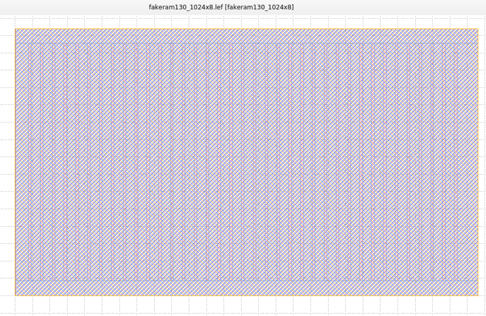
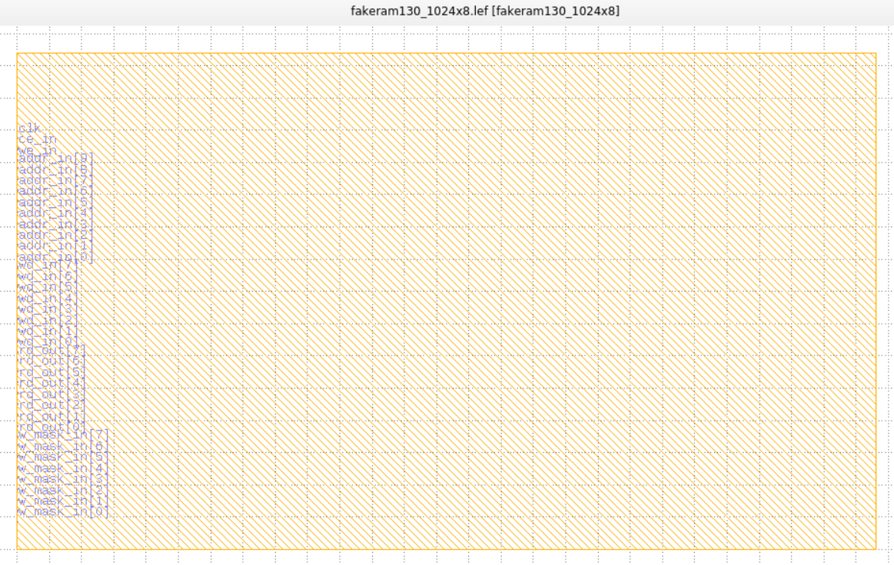
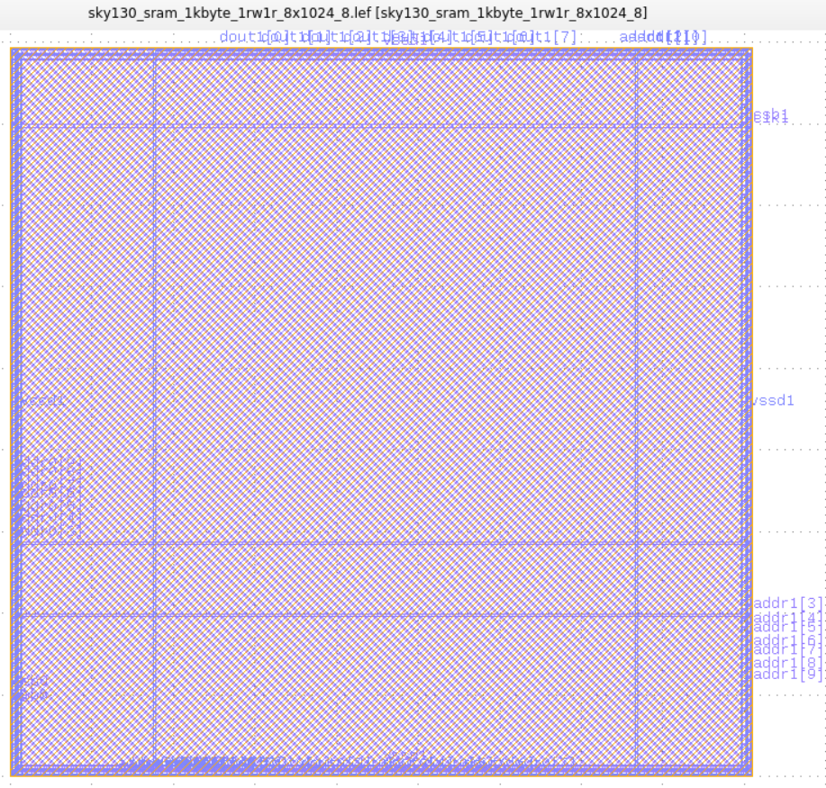
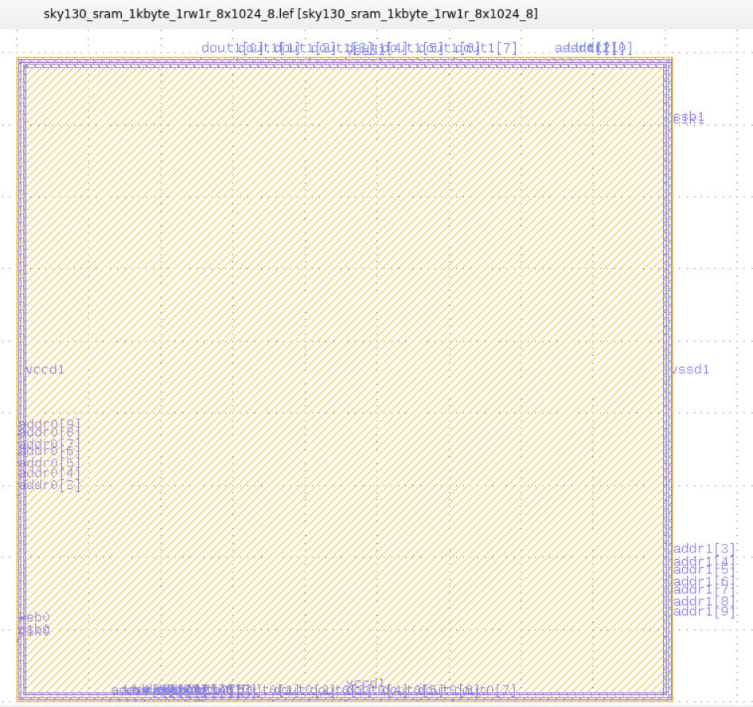

# BSG Black-box SRAM Generator

This project is desgined to generate black-boxed SRAMs for use in CAD flows
where either an SRAM generator is not avaible or doesn't exist.

## Setup

The black-box SRAM generator depends on lightly modified version of
[Cacti](https://github.com/HewlettPackard/cacti) for area, power, and timing
modeling. To build this version of Cacti, simply run:

```
$ make tools
```

## Usage

### Configuration File

The input to the BSG Black-box SRAM generator is a simple JSON file that
contains some information about the technology node you are targeting as well
as the size and names of SRAMs you would like to generate. Below is an example
JSON file that can be found in `./example_cfgs/freepdk45.cfg`:

```
{
  "tech_nm": 45,
  "voltage": 1.1,
  "metalPrefix": "metal",
  "pinWidth_nm": 70,
  "pinPitch_nm": 140,
  "snapWidth_nm": 190,
  "snapHeight_nm": 1400,
  "flipPins": True,
  "latch_last_read": 0,
  "srams": [
    {"name": "sram_32x32_1rw", "width": 32, "depth":  32, "banks": 1},
    {"name": "sram_8x512_1rw", "width":  8, "depth": 512, "banks": 1}
  ]
}
```

`tech_nm` - The name of the target technology node (in nm). Used in Cacti for
modeling PPA of the SRAM.

`voltage` - Nominal operating voltage for the tech node.

`metalPrefix` - The string that prefixes metal layers.

`pinWidth_nm` - The width of the signal pins (in nm).

`pinPitch_nm` - The minimum pin pitch for signal pins (in nm). All pins will
have a pitch that is a multuple of this pitch. The first pin will be a
multiple of this pitch from the bottom edge of the macro too.

`snapWidth_nm` - (Optional : 1) Snap the width of the generated memory to a
multiple of the given value.

`snapHeight_nm` - (Optional : 1) Snap the height of the generated memory to a
multiple of the given value.

`flipPins` - (Optional : false) Flip the pins. If set to false then metal 1 is
assumed to be vertical. This means that signal pins will be on metal 4 and the
supply straps (also on metal 4) will be horizontal. If set to true then metal 1
is assumed to be horizontal. This means that signal pins will be on metal 3 and
the supply straps (on metal 4) will be vertical.

`latch_last_read` - (Optional : 0) In the simulation model, if set to 1, then the output data will
latch and remain unchanged when chip-enable is deasserted.

`srams` - A list of SRAMs to generate. Each sram should have a `name`, `width`
(or the number of bits per word), `depth` (or number of words), and `banks`.


### Running the Generator

Now that you have a configuration file, it is time to run the generator. The
main makefile target is:

```
$ make run CONFIG=<path to config file>
```

If you'd perfer, you can open up the Makefile and set `CONFIG` rather than
setting it on the command line.

All of the generated files can be found in the `./results` directory. Inside
this directory will be a directory for each SRAM which contains the .lef, .lib
and v file (as well as some intermediate files used for Cacti).

### Comparison with standard SRAMs generated with OpenRAM compiler

#### Generated Fakerams (Eg:- fakeram130_1024x8)





- The generated fakerams are 1rw RAMs 
- All pins are on the left side and they are all on Metal 3.
- Pins:
  - 1x chip enable 
  - 1x write enable
  - 1x clock 
  - 1x address-in port
  - 1x data-in-data-out port
  - 1x write-mask-in port (bit masked).


- Power rails are vertical (can be made horizontal in the config file) - Alternate VDD and GND rails.
- Metal layers 1, 2, 3 and 4 are blocked, metal 5 is free for routing over.

#### Standard SRAMs compiled with OpenRAM (Eg:- [sky130_sram_1kbyte_1rw1r_8x1024_8](https://github.com/efabless/sky130_sram_macros/tree/main/sky130_sram_1kbyte_1rw1r_8x1024_8))





- 1rw1r RAMs
- Pins cover all 4 sides
- I/O pins use Metal 3 (on left and right sides) & Metal 4 (on top and bottom sides)
- Pins:
  - 2x clock 
  - 2x chip select
  - 1x write enable
  - 2x address-in port
  - 1x data-out port
  - 1x data-in-data-out port
  - 1x write-mask pin/port (byte masked)

- Power pins are in a ring format along the macro edge utilizing Metal 3 (Horizontal) & Metal 4 (Vertical)
- Metal layers 1, 2, 3 and 4 are blocked, metal 5 is free for routing over.


## Feedback

Feedback is always welcome! We ask that you submit a GitHub issue for any bugs,
improvements, or new features you would like to see. We are also receptive to
outside contributions but please be mindful of sensitive information that is
commonly associated with licensed IP.

